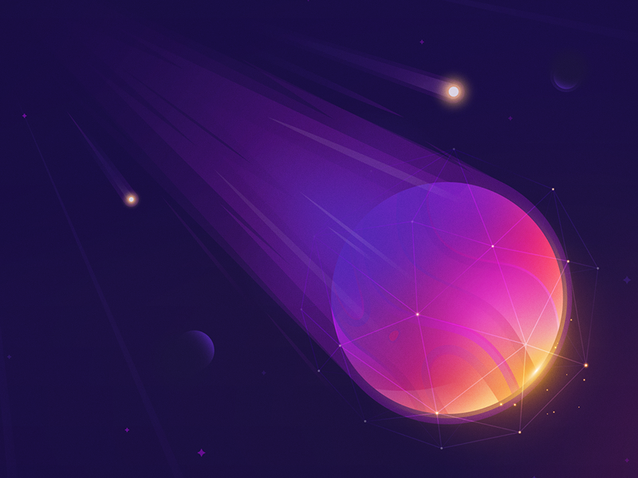

  

<h1 align="center">Comet Launcher</h1>

 

## 🤖 Challenge

Esse projeto foi realizado no [Challenge da FW7](https://github.com/fw7-solucoes/challenges/tree/master/challenge-10), um desafio com o propósito de estudo e gerar engajamento com a comunidade de desenvolvimento.

 

## 🛸 Sobre

Nesse desafio o objetivo é criar uma interface com um botão que gerasse uma bolinha aleatória e ser lançada na interface.

### Objetivos do challenge: 

- Deve ser possível gerar uma bolinha.
- Deve ser possível gerar uma cor aleatória.
- Deve ser possível gerar um tamanho aleatório.
- Deve ser possível gerar uma velocidade aleatória.
- Deve ser possível gerar uma direção aleatória.
- Deve seguir os princípios de colisão da física.

 

## 🛰 Tecnologias e ferramentas utilizadas

- HTML
- CSS
- Javascript
- Netlify

 

👾 Da uma conferida lá no <a href="https://comet-launcher.netlify.app/">Preview</a>

Valeus 🖖
